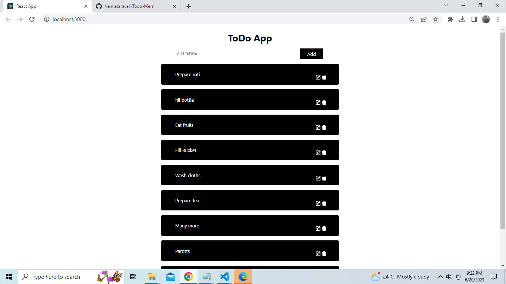

# Todo App using node,React and mongoDB

## Backend

Dependencies to run server
express ,mongoose,cors,dotenv

## Api test

http://localhost:5001/ : for getting all todo's
http://localhost:5001/save: for posting /creating todo'

- http://localhost:5001/delete: for deleting post
  specify id in req.body
  example:in req.body keep this {
  "id":"649135c6250f00c69e6c7fb1"
  }

- http://localhost:5001/update: for updating post
  example:
  {
  "\_id":"649135c6250f00c69e6c7fb1",
  "text":"Buy tea"
  }

# frontend

packages : react-icons (npm i react-icons)

after adding frontend ui
Need to fetch data from backend
once after getting data from backend
need to add add,modify,delete functionality

# server side pagination

How do we restrict the all records sendback to the client once
GET http://localhost:5001/?page=1&size=2
in one page we would get two records.

## paginated response with size

GET http://localhost:5001/api/todo?size=2

GET http://localhost:5001/api/todo?page=5
